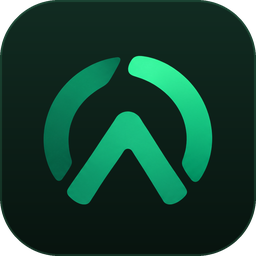
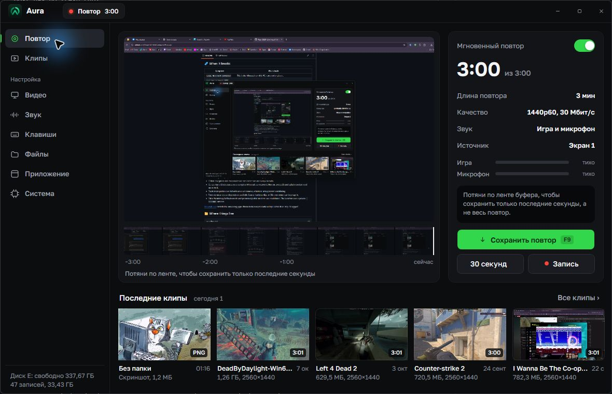
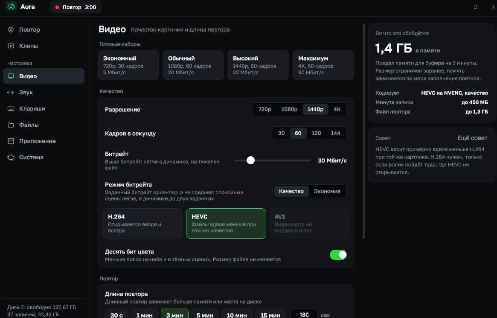
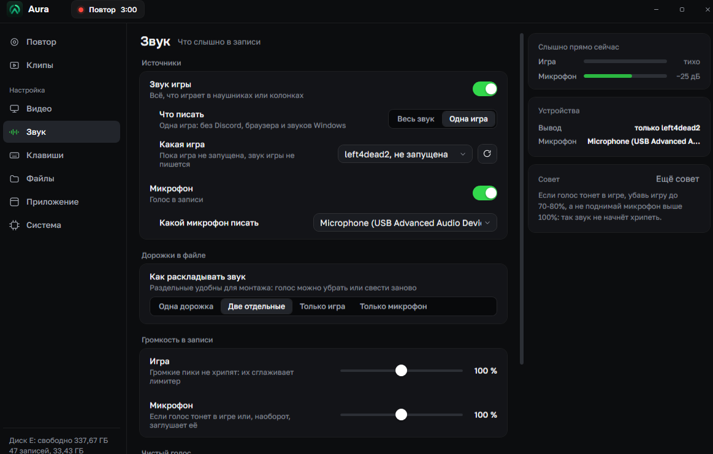
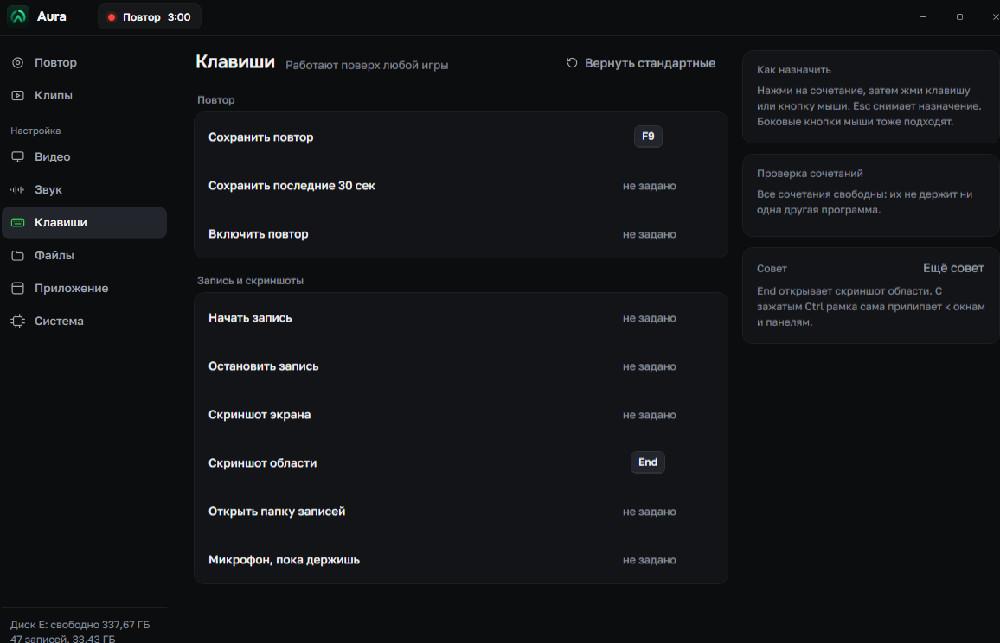
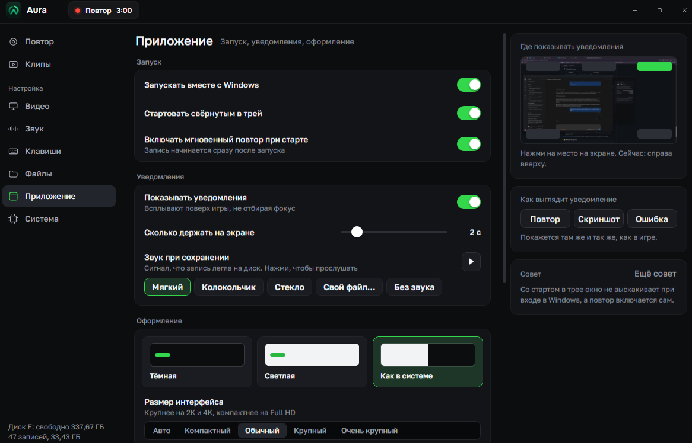

<div align="center">



# Aura

Фоновая запись экрана для Windows. Последние минуты игры всегда лежат в памяти,<br>
одна клавиша сохраняет их в MP4. Работает отдельно от GeForce Experience, Steam и облака.

[](https://github.com/Rizen1322/InstantReplay/releases/latest) [](https://github.com/Rizen1322/InstantReplay/releases) [](https://github.com/Rizen1322/InstantReplay/actions/workflows/ci.yml) 

**[Скачать установщик](https://github.com/Rizen1322/InstantReplay/releases/latest/download/InstantReplaySetup.exe)**

<br>



</div>

## Что умеет

- Держит в памяти последние 30 секунд, минуту, три или до получаса и сохраняет их по клавише. Отдельной клавишей можно сохранить только последние 30 секунд.
- Лента буфера на главном экране: потяни по ней, и сохранятся только нужные секунды.
- Обычная запись с кнопки или клавиши, без ограничения по длине.
- Звук игры и микрофон отдельными дорожками или одной. Можно писать звук только одной игры, без Discord, браузера и системных звуков.
- Шумодав для микрофона и режим «говорю, пока держу клавишу».
- Скриншот экрана или области. Область можно разметить стрелками и текстом до сохранения, пипетка берёт цвет прямо с кадра.
- Раскладывает клипы по папкам игр и подписывает их названием игры.
- Встроенный редактор обрезает клип. Если установлен ffmpeg, клип можно сжать под лимит Discord.
- Уведомления поверх игры, которые не забирают фокус.
- Обновляется сама. Установщик проверяется по подписи перед запуском.

## Как это выглядит

<table>
<tr>
<td width="50%"></td>
<td width="50%"></td>
</tr>
<tr>
<td align="center"><sub>Видео. Справа сразу видно, сколько памяти займёт буфер</sub></td>
<td align="center"><sub>Звук. Режим «Одна игра» пишет только выбранный процесс</sub></td>
</tr>
<tr>
<td width="50%"></td>
<td width="50%"></td>
</tr>
<tr>
<td align="center"><sub>Клавиши. Подходят и боковые кнопки мыши</sub></td>
<td align="center"><sub>Приложение. Автозапуск, уведомления, тема и масштаб</sub></td>
</tr>
</table>

## Клавиши по умолчанию

| Действие | Клавиша |
|---|---|
| Сохранить повтор | <kbd>Alt</kbd> + <kbd>F10</kbd> |
| Сохранить последние 30 секунд | <kbd>Alt</kbd> + <kbd>Shift</kbd> + <kbd>F10</kbd> |
| Включить или выключить повтор | <kbd>Alt</kbd> + <kbd>F11</kbd> |
| Начать запись | <kbd>Alt</kbd> + <kbd>F9</kbd> |
| Остановить запись | <kbd>Alt</kbd> + <kbd>Shift</kbd> + <kbd>F9</kbd> |
| Скриншот экрана | <kbd>Alt</kbd> + <kbd>PrtSc</kbd> |
| Скриншот области | <kbd>PrtSc</kbd> |
| Открыть папку записей | <kbd>Alt</kbd> + <kbd>F8</kbd> |

Любую клавишу можно переназначить на вкладке «Клавиши». Aura сама проверяет, не занято ли сочетание другой программой.

## Как устроено



Кадр от захвата до кодировщика остаётся в видеопамяти. В оперативную память попадает только сжатое видео, около 4 МБ на секунду при 30 Мбит/с, поэтому процессор почти не нагружается.

Windows отдаёт кадры с запасом, до 120 в секунду. Ровно 60 из них выбирает сетка слотов кодировщика, остальные отбрасываются до копирования. Без запаса любая задержка системы оставляла бы пустой слот, и на его месте появлялся бы повтор предыдущего кадра.

NVENC работает в отдельном процессе. Если драйвер зависнет или упадёт, Aura перезапускает процесс кодировщика и продолжает запись, а сама остаётся живой. После трёх отказов за полчаса она переключается на кодировщик Windows. На видеокартах AMD и Intel он используется сразу.



Сохранение не перекодирует видео. Кадры из кольца копируются в MP4 как есть, поэтому трёхминутный клип на 850 МБ ложится на диск меньше чем за секунду и не нагружает видеокарту посреди игры.

### Сколько памяти нужно

| Длина повтора | Битрейт | Предел памяти |
|---|---|---|
| 1 минута | 30 Мбит/с | 0,6 ГБ |
| 3 минуты | 20 Мбит/с | 1,0 ГБ |
| 3 минуты | 30 Мбит/с | 1,4 ГБ |
| 3 минуты | 60 Мбит/с | 2,8 ГБ |

Предел считается с запасом на всплески битрейта и на время сохранения. Память занимается по мере заполнения повтора и выше предела не растёт. Для длинных повторов есть буфер на диске: тогда память почти не тратится.

### Режим битрейта



**Качество** включено по умолчанию на NVIDIA. Кодировщик держит постоянное качество картинки: спокойные сцены весят меньше, в динамике битрейт может подняться до двух заданных. Заданный битрейт здесь ориентир для уровня качества и потолок, а не обещанный средний.

**Экономия** пишет ровно заданный битрейт, размер клипа предсказуем. AV1 и кодировщики Windows пока работают только так. Строка «Кодирует» на вкладке «Видео» показывает, какой режим включён на самом деле.

Раньше Aura писала обычным VBR. NVENC считает его средний за всю сессию, поэтому минуты спокойного рабочего стола копили запас, и игра потом шла на потолке. На графике это видно: одни и те же кадры CS2 получали 30,8 Мбит/с сразу и 60,1 Мбит/с после двух минут рабочего стола.



Так режим «Качество» выглядит в настоящей игре. Тихое начало стоит 20 Мбит/с, перестрелки доходят до 52, потолок 60 не пробивается ни разу.

## Требования

- Windows 10 версии 2004 или новее, Windows 11. Только x64.
- Видеокарта с аппаратным кодировщиком: NVIDIA (NVENC), AMD или Intel. AV1 доступен на картах, которые его кодируют.
- Aura запускается с правами администратора.
- Режим «Одна игра» для звука требует Windows 11.

## Сборка из исходников

Нужен .NET 10 SDK. Нативные части (прослойка NVENC, хост кодировщика, хук захвата) собираются Zig. Сборка сама скачивает его скриптом `packaging/get_zig.ps1`.

```bash
dotnet build -c Release -r win-x64 src/Aura/Aura.csproj
```

```bash
dotnet test tests/InstantReplay.Tests/InstantReplay.Tests.csproj
```

Устройство конвейера, принятые решения, известные тонкости и выпуск версий описаны в [docs/РАЗРАБОТКА.md](docs/РАЗРАБОТКА.md).
